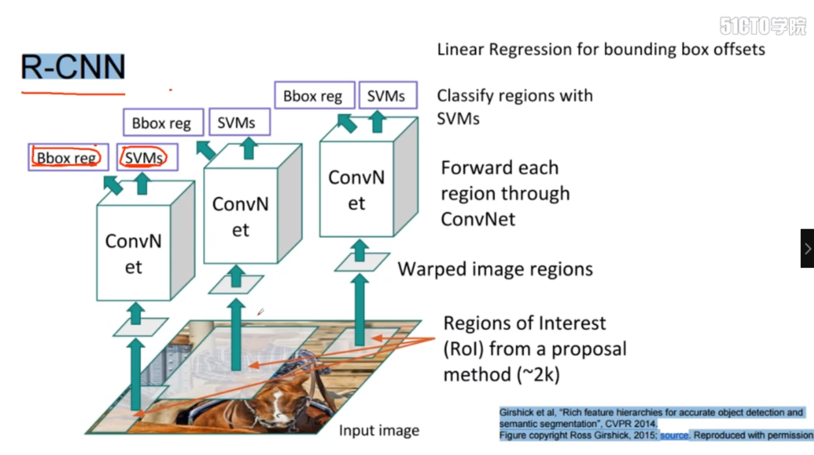
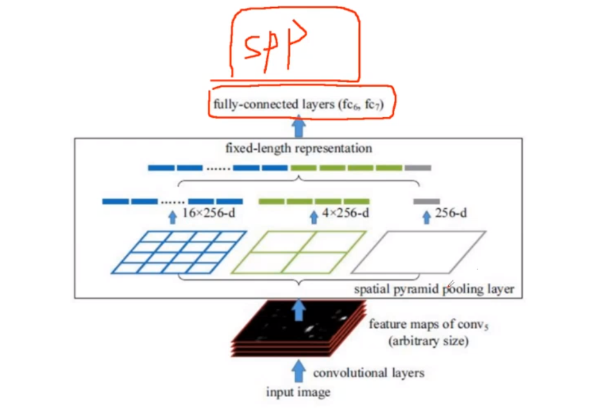
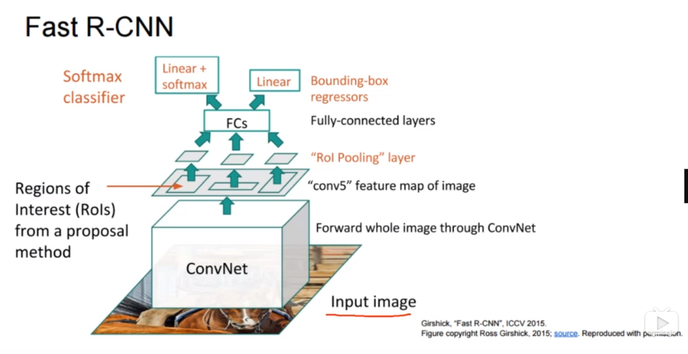
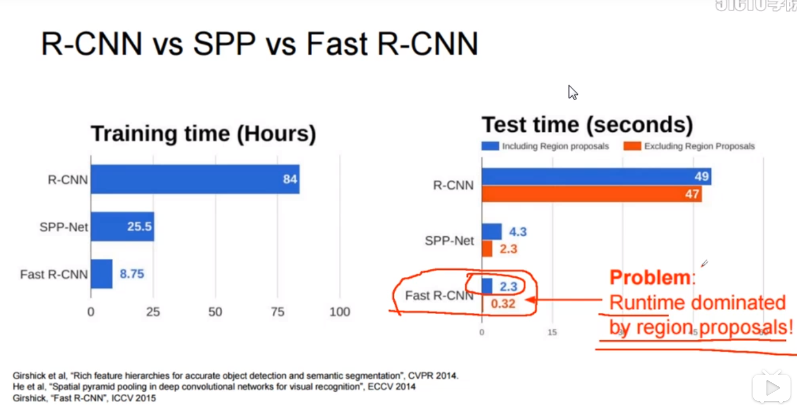
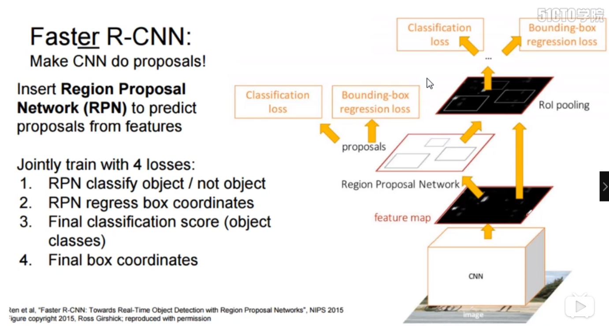

# R-CNN

R-CNN执行过程：

1. selective search算法，对图像进行预处理，产生一些候选框
2. 对每一个候选框分别执行卷积网络操作
3. SVMS分类，Bbox回归

问题：

1. 没有共享卷积网络（全连接层要保持一致，而候选框大小不同），
2. SVMs分类太麻烦

# SPP

SPP net：pooling层使得特征图大小一致，全连接层可连

# Fast R-CNN

Fast R-CNN执行过程：

1. 先执行卷积，一张图共享卷积
2. 在特征图上找原始图片的特征
3. "Rol Pooling"layer（SPP层的特例），得到的特征大小是固定的
4. 全连接层
5. Linear回归、Linear+softmax分类

问题：

不是end to end的神经网络

# R-CNN vs SPP vs Fast R-CNN

在Fast R-CNN中，测试时间主要是产生候选框所耗费的时间（它只能在CPU中算候选框，无法叠加到神经网络中）。

# Faster R-CNN

Faster-RCNN执行过程：

1. 用CNN卷积网络得到特征图
2. 1. Classification loss:对候选框中的内容进行二分类，判断内容为前景（物体）或背景
   2. Bouding-box regression loss:使得候选框尽量与物体重合
3. Rol pooling之后：
   1. Classification loss :执行多分类，判断物体的具体标签
   2. Bounding-box:找到最合适的边框回归的位置

Faster R-CNN最重要的是Region Proosal Network(RPN)层，产生候选框。

优点：

1. 将所有的操作都放到神经网络中，是end to end.
2. 卷积层共享
3. 框也在过程中展现出来